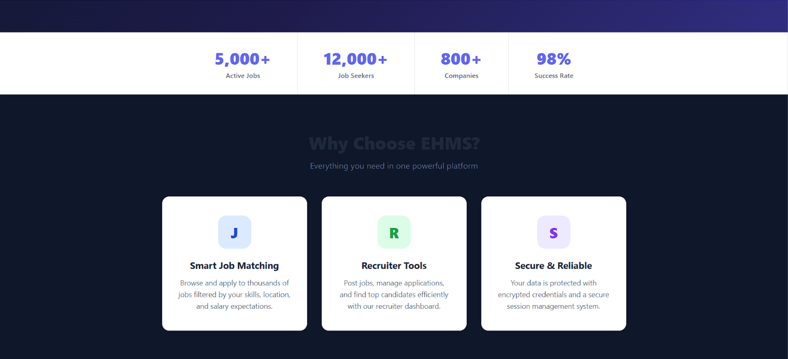
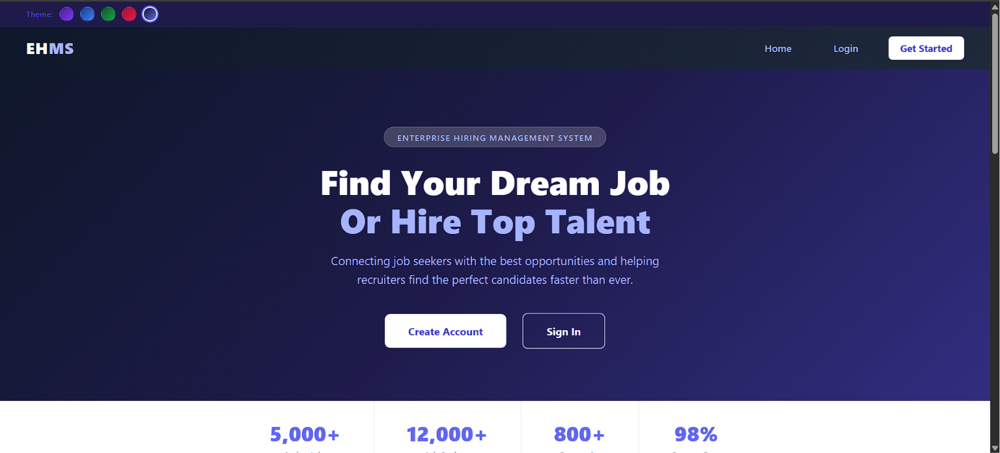

# HireHub-Online-Job-Portal
A web-based job portal that connects job seekers with recruiters, enabling job posting, application management, and candidate tracking through a centralized platform.

# HireHub – Online Job Portal

## Overview

HireHub is a web-based recruitment platform developed using Java, JSP, Servlets, Hibernate (JPA), and MySQL. The system bridges the gap between recruiters and job seekers by providing a centralized platform for job posting, application management, and candidate tracking.

## Features

### Authentication & Security
- User Registration
- Recruiter Registration
- Secure Login & Logout
- Forgot Password Functionality
- Password Validation and Management

### Candidate Features
- Search Available Jobs
- View Job Details
- Apply for Multiple Jobs
- Track Applied Jobs
- Manage Personal Profile
- Update Profile Information

### Recruiter Features
- Post New Job Openings
- Edit Existing Job Posts
- Delete Job Posts
- View Posted Jobs
- View Applicants for Each Job
- Track Number of Applications per Job
- Manage Recruiter Profile

### Application Management
- Online Job Application Submission
- Application Tracking System
- Candidate-Job Mapping
- Recruiter Access to Applicant Data

### Notification System
- Email Notification on Successful Job Application
- Automated Communication Support

### Technical Features
- MVC Architecture
- DAO Design Pattern
- Hibernate ORM Integration
- JPA-Based Persistence
- MySQL Database Connectivity
- Session Management
- Role-Based Access Control

## Technology Stack

### Frontend
- JSP
- HTML
- CSS
- Bootstrap

### Backend
- Java
- Servlets
- Hibernate / JPA

### Database
- MySQL

### Server & Tools
- Apache Tomcat
- Maven
- Eclipse IDE
- Git & GitHub

## Project Structure

- Entity Layer
- Controller Layer
- DAO Layer
- Utility Layer
- JSP Views

## Future Enhancements

- Resume Upload
- Job Recommendation System
- Interview Scheduling
- Admin Dashboard
- Application Status Updates
- AI-Based Candidate Matching
## Screenshots

### Home Page - Landing View

### Home Page - Job Listings

### Home Page - Features Section

